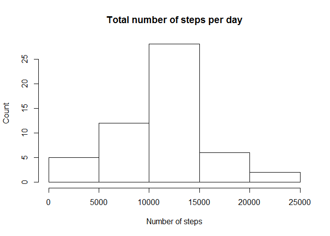
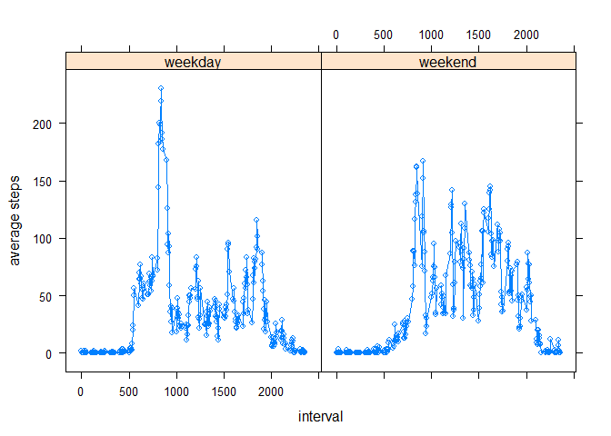

# Reproducible Research: Peer Assessment 1


## Loading and preprocessing the data

```r
# SET this to the folder of the git repo
setwd("C:/Coursera/Course project/RepData_PeerAssessment1")
data <- read.csv(unz("activity.zip", "activity.csv"))
# Convert to date type
data$date <- as.POSIXlt(data$date)
```

## What is mean total number of steps taken per day?

```r
library(plyr)
```

```
## Warning: package 'plyr' was built under R version 3.2.2
```

```r
# Filter out the missing values in data
data.filter <- subset(data, steps!="NA")
step.by.day <- ddply(data.filter, .(date), summarize, total=sum(steps))
hist(step.by.day$total, main="Total number of steps per day", xlab = "Number of steps", ylab="Count")
```

 

```r
print("Mean and media of the total number of steps taken per day")
```

```
## [1] "Mean and media of the total number of steps taken per day"
```

```r
summary(step.by.day$total)
```

```
##    Min. 1st Qu.  Median    Mean 3rd Qu.    Max. 
##      41    8841   10760   10770   13290   21190
```

## What is the average daily activity pattern?

```r
data.by5min <- ddply(data.filter, .(interval), summarize, average_5min=mean(steps))
plot(data.by5min$interval, data.by5min$average_5min, type="l", xlab="Interval", ylab="Average number of steps")
```

 

```r
idx<-which(data.by5min$average_5min==max(data.by5min$average_5min))
data.by5min$interval[idx]
```

```
## [1] 835
```
Interval with max steps on average: 835

## Imputing missing values

```r
# install.packages("hash")
library(hash)
```

```
## Warning: package 'hash' was built under R version 3.2.2
```

```
## hash-2.2.6 provided by Decision Patterns
```

```r
map <- hash(data.by5min$interval, data.by5min$average_5min)
print(paste("Number of missing values: ", (nrow(data) - nrow(data.filter))))
```

```
## [1] "Number of missing values:  2304"
```

```r
# For missing values, assign the same interval steps to them
data.new <- data
for(i in 1:nrow(data.new)) {
    if(is.na(data.new$steps[i])) {
        interv <- as.character(data.new$interval[i])
        data.new[i,]$steps <- map[[interv]]
    }
}
step.day.new <- ddply(data.new, .(date), summarize, total=sum(steps))
hist(step.day.new$total, main="Total number of steps per day", xlab = "Number of steps", ylab="Count")
```

 

```r
summary(step.day.new$total)
```

```
##    Min. 1st Qu.  Median    Mean 3rd Qu.    Max. 
##      41    9819   10770   10770   12810   21190
```
Imputing missing date has very slight impact on the average steps of the day, the mean is still the same while the median has a little decrease (10770 vs. 10760).


## Are there differences in activity patterns between weekdays and weekends?

```r
library(lattice)
weekend.idx <- which(weekdays(data.new$date)=="Saturday" | weekdays(data.new$date)=="Sunday")
data.new$weekend <- 0
data.new[weekend.idx,]$weekend <-1
data.new$weekend <- factor(data.new$weekend, levels=c(0,1), labels=c("weekday","weekend"))
step.weekday <- ddply(data.new, .(interval, weekend), summarize, average=mean(steps))
xyplot(average ~interval| weekend, data=step.weekday, type='b', ylab="average steps")
```

 


